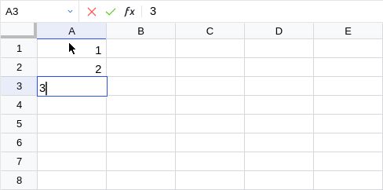

# Core Language (modulo changes, new features and bugs)

The provided core language (see [`Recalc.Language`][recalc-language])
implements a simple, dependently typed functional programming language
based on LambdaPi[^1], which is extended by

- cell references (sized, nested multi-dimensional arrays), and
- implicit arguments.

## Syntax

Cell references and ranges are similar to Excel:

\begin{aligned}
\mathfrak{m} \
  \mathrel{::=} & 1 \mid 2 \mid \dots \\
\mathfrak{n} \
  \mathrel{::=} & \text{A} \mid \text{B} \mid
      \dots \mid \text{AA} \mid \dots \\
\alpha
  \ \mathrel{::=} & \ \mathfrak{n}\ \mathfrak{m}
          \mid \mathfrak{n}\ \mathfrak{m}\ \textbf{:}\ \mathfrak{n}\ \mathfrak{m} \\
\\
\textit{sheet-id}
  \ \mathrel{::=} &
    \ \textit{simple-sheet-name}
    \\ \mid &
    \ \texttt{'} \textit{sheet-name} \texttt{'}
    \\ \mid &
    \ \texttt{[}\ \textit{simple-uri}\ \texttt{]} \textit{simple-sheet-name}
    \\ \mid &
    \ \texttt{'[}\ \textit{uri}\ \texttt{]} \textit{sheet-name} \texttt{'} \\
\\
\xi
  \ \mathrel{::=} & \ \Bigl[\textit{sheet-id}\ \textbf{!}\Bigr]\ \alpha
\end{aligned}

Where \(\textit{uri}\) and \(\textit{sheet-name}\) must be printable, and
characters `'[]\` need to be escaped with `\`. The corresponding \(\textit{simple-}\)
prefixed versions may only contain alphanumeric characters and `._~`.

When \(\textit{sheet-id}\) is not (or partially) provided, it is
implicitly defined as the \(\textit{uri}\) and/or \(\textit{sheet-name}\)
of the location where it is being read.

Terms and types share the syntax of a standard lambda calculus with dependent
functions:

\begin{array}{ll}
\text{f}, \text{x}, \sigma, \tau & \mathrel{::=}
    & \textit{literal}
            & \color{grey}{\text{-- decimals and Boolean values}}
  \\ & \mid & \text{v}
            & \color{grey}{\text{-- variables}}
  \\ & \mid & \texttt{\\} \text{v}\ \texttt{->}\ \text{x}
            & \color{grey}{\text{-- lambda abstraction}}
  \\ & \mid & \texttt{*}
            & \color{grey}{\text{-- kind of types}}
  \\ & \mid & \texttt{(} \text{v}\texttt{:}\ \sigma \texttt{) -> } \tau
            & \color{grey}{\text{-- dependent function type}}
  \\ & \mid & \texttt{\{} \text{v}\texttt{:}\ \sigma \texttt{\} -> } \tau
            & \color{grey}{\text{-- implicit dependent function type}}
  \\ & \mid & \xi
            & \color{grey}{\text{-- cell reference}}
  \\ & \mid & \text{f(x}_1, \dots\text{)}
            & \color{grey}{\text{-- application}}
  \\ & \mid & \text{f\{x}_1, \dots\text{\}}
            & \color{grey}{\text{-- explicit application of an implicit argument}}
\end{array}

where \(\textit{literal}\) includes signed decimals, `int`, `bool`, `false`,
and `true`. Identifiers are case-insensitive.

When a function type ignores its argument it can be written as
\(\sigma \texttt{ -> } \tau\) and similarly
\(\text{\{}\sigma\text{\}} \texttt{ -> } \tau\) for implicit arguments.

## Typechecking and Inference

The typing judgements and evaluation rules follow directly the `LambdaPi`
implementation (a simple bi-directional typechecker). The only notable
difference is that we introduce another context \(\sigma\) which gives
the type \(\sigma_T(\xi)\) and value \(\sigma_V(\xi)\) of a cell.

The original rules are trivially extended, passing the additional \(\sigma\)
around. For example, the rule \(\small{\text{CHK}}\) would be extended as
follows:

\begin{array}{c}
  \Gamma, \sigma\ \vdash\ e\ ::_{\uparrow}\ \tau \\ \hline
  \Gamma, \sigma\ \vdash\ e\ ::_{\downarrow}\ \tau
\end{array}

### Cell References

Rules concerning cell references and cell ranges make use of the new type
constructor \(\text{<}..\text{>[}\tau\text{]}\) for tensors (not part of the
surface language) and are quite simple:

\begin{array}{c}
  \sigma_T(\textit{sheet-id}\ \textbf{!}\ \mathfrak{n}\ \mathfrak{m}) = \tau \\ \hline
  \Gamma, \sigma\ \vdash\ \textit{sheet-id}\ \textbf{!}\ \mathfrak{n}\ \mathfrak{m}\ ::_{\uparrow}\ \tau
\end{array}

\begin{array}{c}
  \sigma_T(\textit{sheet-id}\ \textbf{!}\ \mathfrak{n}\ \mathfrak{m}) = \tau \\
  \forall i j. (i,j) \in \mathfrak{n}\ \mathfrak{m}\ \textbf{:}\ \mathfrak{n}'\ \mathfrak{m}'
    \implies \sigma_T(\textit{sheet-id}\ \textbf{!} (i,j)) = \tau \\
  m = \mathfrak{m}' - \mathfrak{m} \land n = \mathfrak{n}' - \mathfrak{n} \\
  dims = \text{inferDimensions}(m, n, \tau) \\ \hline
  \Gamma, \sigma
    \ \vdash\
    \textit{sheet-id}\ \textbf{!}\ \mathfrak{n}\ \mathfrak{m}\ \textbf{:}\ \mathfrak{n}'\ \mathfrak{m}'
    ::_{\uparrow}
    \text{<}dims\text{>}\lfloor\tau\rfloor
\end{array}

The first one just states that a simple cell reference has the same type as the
type of the term at that location.

The second one is similar. Using the top left corner of a selection it makes sure
that all cells in the referred range share that type \(\tau\). The type of a cell
range is a tensor with elements \(\lfloor\tau\rfloor\).

(where \(\lfloor\_\rfloor\) is an identity for all types except tensor types
\(\text{<}..\text{>[}\tau'\text{]}\) for which it is defined as \(\tau'\))

The dimensions of the resulting tensor are given by

\[
  \text{inferDimensions}(m,n,\tau) \mathrel{::=}
  \begin{cases}
    n, \text{dim}(\tau) & \text{if }m = 1, \\
    m, \text{dim}(\tau) & \text{if }n = 1, \\
    m, n, \text{dim}(\tau) & \text{otherwise}.
  \end{cases}
\]

\[
  \text{dim}(\tau) \mathrel{::=}
  \begin{cases}
    \bar{d}   & \text{if }\tau\text{ has shape <}\bar{d}\text{>[}\tau'\text{]}, \\
    \small{\text{[ ]}} & \text{otherwise}.
  \end{cases}
\]

That is, referring to an \(m \times n\) range of cells gives a tensor which
potentially can become higher order when the elements are tensors by themselves.

### Implicit Arguments

Implicit arguments are covered by

\begin{array}{c}
  \Gamma, \sigma
    \ \vdash\ \texttt{f} ::_{\uparrow}
      \texttt{\{} \texttt{v}\texttt{:}\ \sigma \texttt{\} -> } \tau' \\
  \Gamma, \sigma
    \ \vdash\ \texttt{x} ::_{\downarrow} \sigma \\
  \tau' \bigl[\texttt{v} \mapsto \texttt{x}\bigr] \Downarrow\ \tau'
  \\ \hline
  \Gamma, \sigma
    \ \vdash\ \texttt{f\{x\}} ::_{\uparrow} \tau'
\end{array}

which follows the regular application rule, and

\begin{array}{c}
  \Gamma, \sigma
    \ \vdash\ \texttt{f} ::_{\uparrow}
      \prod_i\texttt{\{} \texttt{v}_i\texttt{:}\ \sigma_i \texttt{\}.}
      \texttt{ (v: }\sigma\texttt{) -> } \tau
  \\
  \Gamma, \sigma
    \ \vdash\ \texttt{x} ::_{\uparrow} \sigma' \\
  I, S = \text{unify(}\sigma, \sigma'\text{)} \\
  \tau \bigl[\texttt{v} \mapsto \texttt{x}\bigr] S \Downarrow\ \tau'
  \\ \hline
  \Gamma, \sigma
    \ \vdash\ \texttt{f(x)} ::_{\uparrow}
      \prod_{i \in I}\texttt{\{v}_i\texttt{: }\sigma_i\texttt{\} -> }\tau'
\end{array}

which uses unification to solve for implicict arguments (and leaves uninferrable
untouched out). That is, \(I\) is the set of variables which are left unsolved by
\(\text{unify}\), and \(S\) is a substitution from implicit variables to the solved
terms that unifies \(\sigma'\) and \(\sigma'\).

## Evaluation

The evaluation rules for the language extended to spreadsheets are equally
simple. They abstract the recalculation using the context \(\sigma\) introduced
earlier and extends existing rules accordingly.

The new rules become:

\begin{array}{c}
  \sigma_V(\textit{sheet-id}\ \textbf{!}\ \mathfrak{n}\ \mathfrak{m}) = v \\ \hline
  \sigma\ \vdash\ \textit{sheet-id}\ \textbf{!}\ \mathfrak{n}\ \mathfrak{m}\ \Downarrow\ v
\end{array}

\begin{array}{c}
  \sigma_V(\textit{sheet-id}\ \textbf{!}\ (i,j)) = v_{i,j} \\ \hline
  \sigma\ \vdash\ \textit{sheet-id}\ \textbf{!}
    \ \mathfrak{n}\ \mathfrak{m}\ \textbf{:}\ \mathfrak{n}'\ \mathfrak{m}'
    \Downarrow\ [ \text{..} v_{i,j} ]_{
      (i,j) \in \mathfrak{n}\ \mathfrak{m}\ \textbf{:}\ \mathfrak{n}'\ \mathfrak{m}'
    }
\end{array}

(where \(\text{..}\_\) flattens a tensor value and acts as an identity otherwise)

---

Thus references to cell ranges behave as nested arrays with dependently typed
sizes:

<!-- !!! warning "⚠️ There may be constructs implemented that are not documented here" -->

<!-- Footnotes & References -->
  [^1]: Andres Löh, Conor McBride, Wouter Swierstra. [_A Tutorial Implementation of a Dependently Typed Lambda Calculus_](https://dl.acm.org/doi/10.5555/1883634.1883637).

  [recalc-language]: ./haddock/recalc/recalc-spec/Recalc-Language.html
