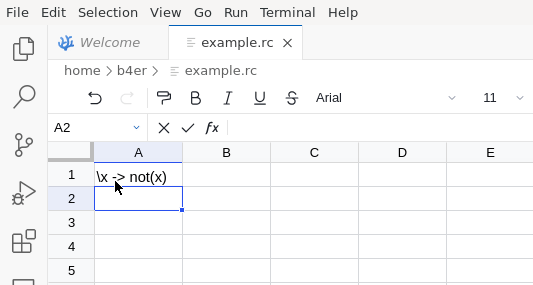
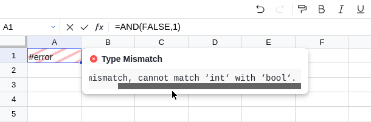

# Introduction

Recalc is a work-in-progress spreadsheet engine built in Haskell.  It's a
playground for experimenting with functional programming languages embedded
in spreadsheets.

It includes a frontend as VS Code Web Extension built using the
[Univer Sheet API][univer-sheet-api]:

The recalculation engine is kept generic and is compatible with any
implementation of the following interface:

---

\(
\color{grey}{\operatorname{-- |}\ \text{cell addresses given as zero-indexed tuple @(row, col)@}} \\
\textbf{type}\ \text{CellAddr} = (\text{Int}, \text{Int}) \\
\color{grey}{\operatorname{-- |}\ \text{a cell range @(start, end)@}} \\
\textbf{type}\ \text{CellRange} = (\text{CellAddr}, \text{CellAddr})
\)

\(
\textbf{class}\ \text{Language}\ \Psi\ Term\ Value\ \textbf{where}\\
  \quad \text{deps} : \tau \to \text{Set}(\text{CellRange}) \\
  \quad \text{newEnv} : \text{SheetId} \to \Psi \\
  \quad \text{infer} : \tau \to \text{Fetch } Type \\
  \quad \text{inferValue} : \Psi \to Type \to \text{Maybe}\ Type \\
  \quad \text{eval} : \tau \to \text{Fetch } \text{Value} \\
 \; \textbf{where}\\
  \quad \operatorname{type}\ Type = Value
\)

(see [`Recalc.Engine`][recalc-language])

---

For now[^1] the `Language`s are restricted to those where types and values
coincide (i.e. dependently typed languages).

The type `Fetch` mentioned above is more generic and custom errors can be
introduced there:

The Web Extension includes a dependently typed functional programming language
(see [here][core]) which is actively developed (expect things to break).

<!-- Footnotes & References -->

  [^1]: The [`Fetch`](haddock/src/Recalc.Engine.Language.html#Fetch) monad
        currently only allows fetching a `value`, however this could be changed.

  [univer-sheet-api]: https://docs.univer.ai/en-US/guides/sheets/features/core/sheet-api
  [recalc-language]: ./haddock/Recalc-Engine.html#t:Language
  [core]: ./core.md
