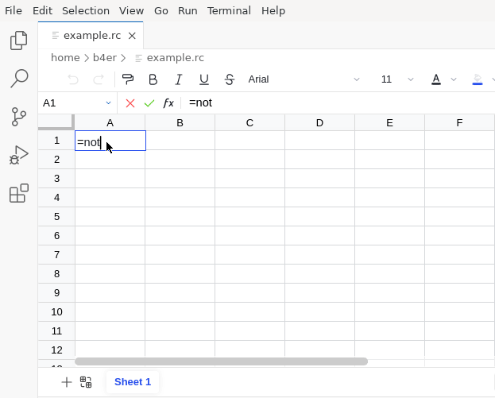

# Introduction

Recalc is a work-in-progress spreadsheet engine built in Haskell.  It provides
a DSL for for experimenting with functional spreadsheet languages.

It includes a frontend as VS Code Extension built using the
[Univer Sheet API][univer-sheet-api]:

The DSL allows custom languages and automatically provides features such as:

- [_Cell Diagnostics_](./gifs/type-error.gif)
- [_Sheet-Defined Functions_](./gifs/sheet-defined-function.gif)
- _Function Explorer_
- cross-sheet references, etc.

The [Web Extension][install] includes a dependently typed functional programming
language (described [here][core]).

<!-- Footnotes & References -->

  [univer-sheet-api]: https://docs.univer.ai/en-US/guides/sheets/features/core/sheet-api
  [install]: ./install.md
  [core]: ./core.md
